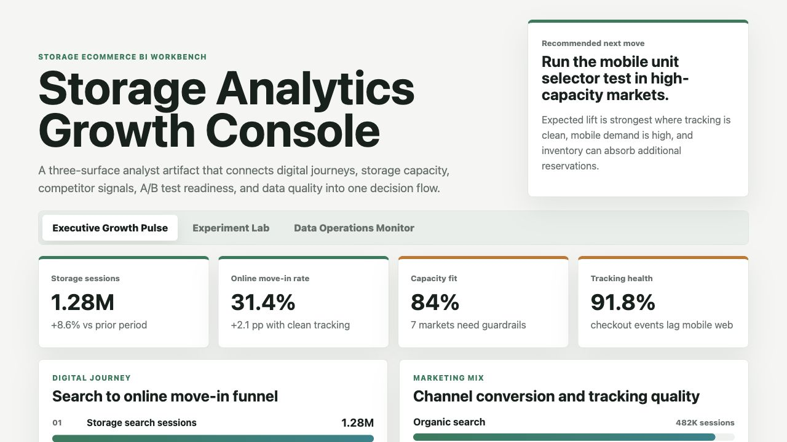
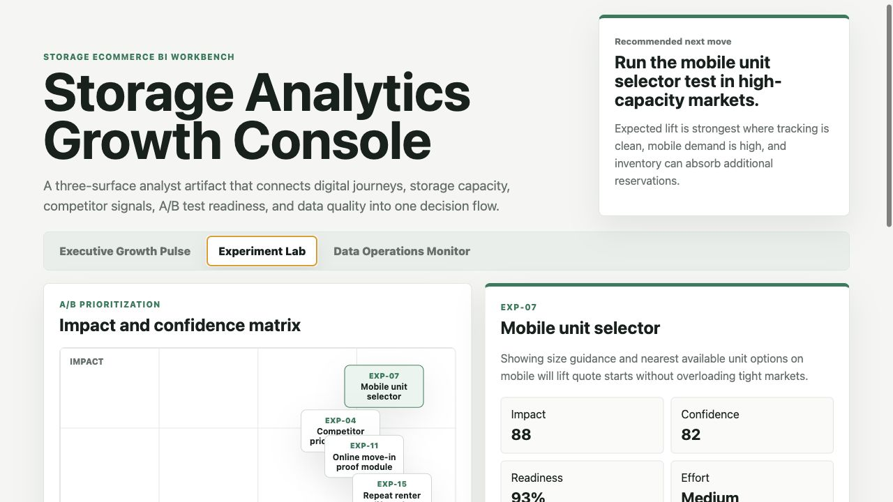
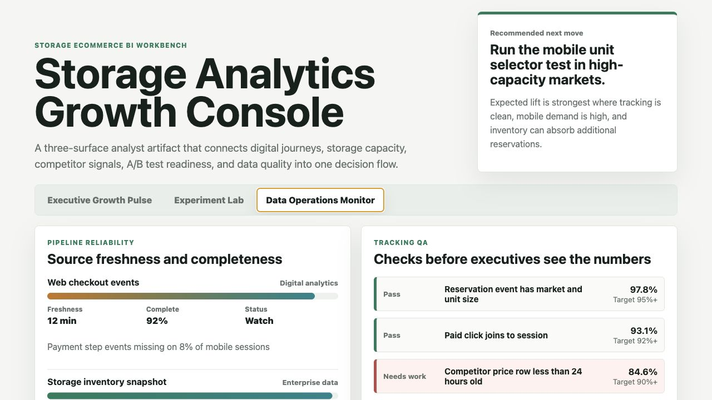

# Storage Analytics Growth Console

A BI analyst workbench for a storage ecommerce team deciding where to focus growth effort across digital journeys, marketing channels, storage capacity, competitor pressure, A/B test readiness, and data quality.

The project is intentionally built as a three-surface artifact rather than a single dashboard. It shows how an analyst can move from executive reporting to experiment design to pipeline trust checks before recommending a product or marketing action.

## Screenshots



Caption: The Executive Growth Pulse connects search demand, online move-in conversion, channel quality, occupancy, capacity fit, and market-level actions so stakeholders can see where growth is operationally usable.



Caption: The Experiment Lab prioritizes A/B tests with impact, confidence, tracking readiness, capacity fit, effort, and competitor risk, then turns the selected test into a measurement plan with guardrails.



Caption: The Data Operations Monitor checks source freshness, event completeness, competitor feed health, and BI refresh readiness before executives use the dashboard numbers.

## What This Demonstrates

- Building BI tools for ecommerce, marketing, and operations data.
- Designing A/B test readouts with primary metrics, sample expectations, duration, and guardrails.
- Using Python to automate experiment scoring.
- Writing SQL-style checks and data quality logic for tracking validation.
- Connecting competitor product data, storage capacity, and digital journey behavior into one business recommendation.
- Presenting findings in stakeholder-ready language.

## Data

This project uses synthetic data. It is not real company performance data.

The data is modeled on common storage ecommerce structures:

- Market-level demand, occupancy, storage capacity, and unit availability.
- Digital journey activity from search sessions to unit detail views, quote starts, reservations, and online move-ins.
- Marketing channels including organic search, paid search, direct, email, and affiliate traffic.
- Competitor price observations by market and unit type.
- Experiment backlog inputs used to score A/B test readiness.
- Tracking QA and pipeline freshness checks used before BI refresh.

Synthetic assumptions are documented in [data/README.md](data/README.md). The scoring method is documented in [analysis/methodology.md](analysis/methodology.md).

## Analytical Method

The experiment priority score is intentionally transparent:

```text
score =
  impact_score * 0.36
  + confidence_score * 0.24
  + tracking_readiness_pct * 0.16
  + capacity_fit_pct * 0.14
  - effort_score * 0.06
  - competitor_risk_score * 0.04
```

This keeps the model explainable for business stakeholders. It rewards tests with meaningful upside, clean tracking, and enough storage capacity to act on the result. It penalizes tests that are hard to execute or exposed to competitor pressure.

## Recommendation

Run the mobile unit selector test first in high-capacity markets. It has the best overlap of demand, expected lift, tracking readiness, and operational capacity. Use competitor price guardrails as a paid media budget control, and keep online move-in proof messaging as the next product test.

## Scope

This artifact does:

- Render a browser-based BI workbench with three distinct surfaces.
- Include synthetic datasets, analysis notes, SQL checks, and a Python scoring script.
- Show a defensible workflow from data validation to experiment prioritization to executive recommendation.

This artifact does not:

- Connect to live production systems.
- Claim to represent real storage operator performance.
- Replace a full BI platform, warehouse job, or production experimentation service.

## Repository Structure

- `index.html` contains the interactive workbench.
- `src/` contains the data fixture, interaction logic, and styling.
- `data/` contains synthetic operating data and source documentation.
- `analysis/` contains methodology, SQL checks, executive findings, and ranked outputs.
- `scripts/score_operating_data.py` scores experiment candidates.
- `docs/images/` contains the rendered screenshots.

## Run Locally

```bash
python3 -m http.server 4175
```

Then open `http://localhost:4175`.

To run the scoring script:

```bash
npm run analyze
```
