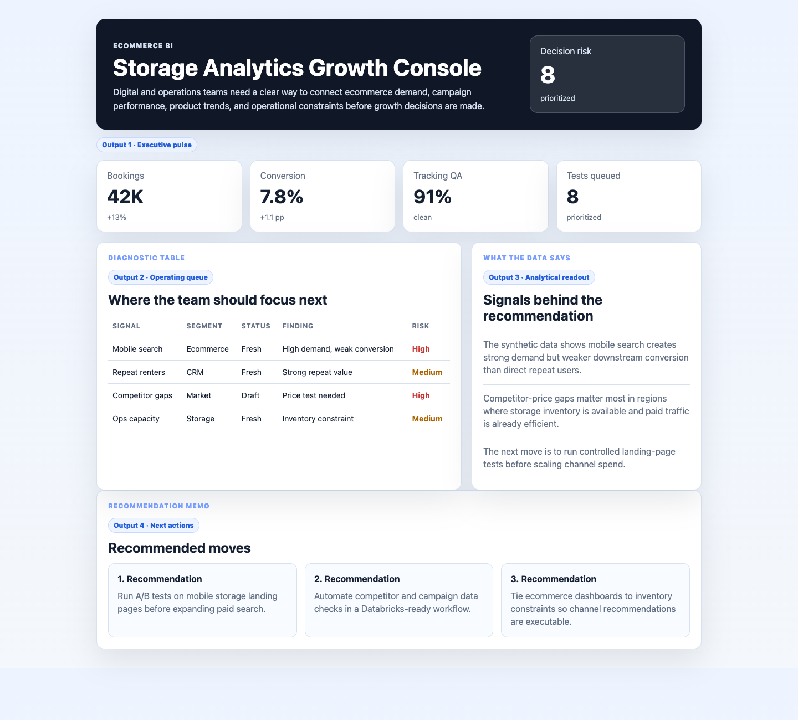

# Storage Analytics Growth Console

I built this because ecommerce and storage analytics need to connect marketing journeys, operational demand, and product performance into one trusted view. The project models how BI can turn digital behavior, campaign performance, and competitor signals into specific growth actions.



## Why this exists

Digital and operations teams need a clear way to connect ecommerce demand, campaign performance, product trends, and operational constraints before growth decisions are made.

## What is in the project

- A polished dashboard in `index.html`
- Modular UI/data files in `src/`
- Synthetic operating data in `data/synthetic_operating_data.csv`
- A screenshot captured from the rendered app in `docs/images/dashboard.png`

## Dashboard sections

- Growth pulse: bookings, channel ROI, conversion, and dashboard freshness.
- Opportunity table: journey segment, demand signal, tracking quality, and action priority.
- Recommendation memo: A/B tests, Databricks workflow ideas, and dashboard cleanup priorities.

## What the data says

The synthetic data shows mobile search creates strong demand but weaker downstream conversion than direct repeat users.

Competitor-price gaps matter most in regions where storage inventory is available and paid traffic is already efficient.

The next move is to run controlled landing-page tests before scaling channel spend.

## Output walkthrough

### Output 1: Executive pulse

The KPI cards summarize the current operating picture and highlight whether the team should trust, investigate, or act on the latest metrics.

### Output 2: Diagnostic table

The table converts raw operating signals into a ranked queue of risks, owners, and recommended next actions.

### Output 3: Analytical recommendations

The memo turns the analysis into specific business actions that can be discussed in a weekly review or stakeholder workshop.

## Run locally

```bash
python3 -m http.server 4173
```

Then open `http://localhost:4173`.
